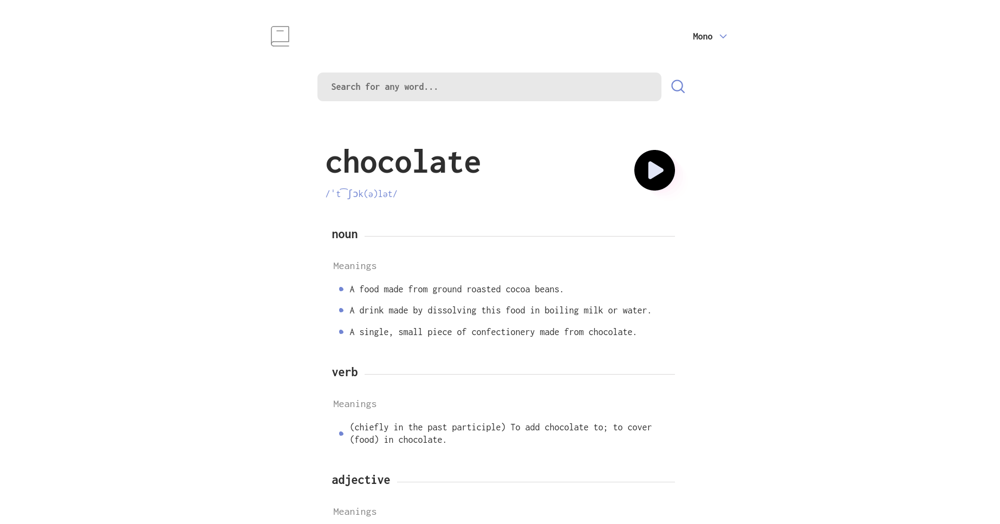

# Dictionary Web App

## Table of contents

- [Overview](#overview)
  - [Screenshot](#screenshot)
  - [Features](#features)
  - [Links](#links)
- [My process](#my-process)
  - [Built with](#built-with)
  - [What I learned](#what-i-learned)
  - [Continued development](#continued-development)
  - [Useful resources](#useful-resources)
- [Author](#author)

## Overview

### Screenshot



### Links

- [Live Site Demo](https://dictionary-webapp-vanilla-js.netlify.app/)
- [Code Repository](https://github.com/MariusHor/dictionary-web-app)

### Features

- Fetching data from the [DictionaryApi](https://dictionaryapi.dev/)
- Handling errors such as validation erros, network errors or general errors
- **State management** using _*LocalStorage*_:
  1. Selected font is being saved and retrieved on app restart
  2. The App saves and retrieves the last 20 searches
- Last 20 searches are being filtered and users can click on them to search for the same word again:
  1. The search must be a valid one
  2. If search is already inside the list then it is not being added
- Users can click a synonym which automatically triggers a new search on that word.
- Activating / Disabling the audio button, depending if the api provides an audio file for the user query
- **_Responsive_** layout

## My process

### Built with

- Mobile-first workflow
- Semantic HTML5 markup
- Scss
- BEM
- JavaScript
- Webpack
- MomentJs
- Bootstrap

### What I learned

I started this project by building upon what I have learned in the Todos App project about the **_MVC architectural pattern_** variations. While I was somehow happy about how that turned out, I kept thinking about the fact the components coupling could still be improved. Throught my online reasearch on how I could achieve this, two things really felt logical to me:

- The **_Publisher/Subscriber_** pattern would be the first one and what I really like about it, as opposed to the callbacks pattern used in the Todos App project, is the fact that it allowed me to have a central component that acted as a router. With this pattern I can have a certain component _publishing_ some kind of data through an event and other components can all _subscribe_ to this specific event to receive and act on the said data. The publisher does not know of its subscribers and they do not know of the publisher. The relationship between components automatically becomes even more **_loosely coupled_** this way. For such a small application this can be a great solution but the whole implementation might require a review on a larger one where the _Pub/Sub_ component might have to deal with too much interaction between components.

```js
pubSub.publish('userInput', value); // publishes a new 'userInput' event containing the data, which is the 'value' variable
pubSub.subscribe('userInput', this.#controlUserInput); // subscribes to the 'userInput' event and provides a callback function that receives the data
```

- While I have used **_Redux_** in the past while learning React, I have decided to really go through all of its online documentation and understand how it works under the hood. It is actually a _Flux Architecture_ variation and _Flux_ was created by _Facebook_ to move away from the MVC pattern but I still felt that the Redux implementation made a lot of sense to me. Therefore in this project I've decided to find a way to adopt some of the things that I have learned from Redux and make them work for an _MVP pattern_ app:

  - The _Model_ now uses a reducer function that receives the state and an action object, returning an entirely new and updated state object. This way we can update the state in an immutable way as we don't actually modify the initial state object:

```js
      case SAVE_CURRENT_FONT:
        return {
          ...state,
          currentFont: action.payload,
        };
```

### Continued development

I would like to continue to learn and practice implementations of *MV\*\* patterns as well as diving more into the *Flux/Redux\* architectural patterns, understanding how they work unde the hood before going back into using React.

One thing that I think I should have understood better was the concepts of _immutability_ and _pure functions_. While I can understand their use for the _Functional Programming_ paradigm of Javascript, I feel that as I have taken an _OOP_ approach on this project, maybe I could have done better at implementing here as well. This, plus starting to learn about Test Driven Developement are some of the things that I will try to focus moving on.

### Useful resources

- [Dictionary web app challenge on Frontend Mentor](https://www.frontendmentor.io/challenges/dictionary-web-app-h5wwnyuKFL) - I used this as a starting point and developed the design to my taste

## Author

- Github - [@MariusHor](https://github.com/MariusHor/)
- Frontend Mentor - [@MariusHor](https://www.frontendmentor.io/profile/MariusHor)
